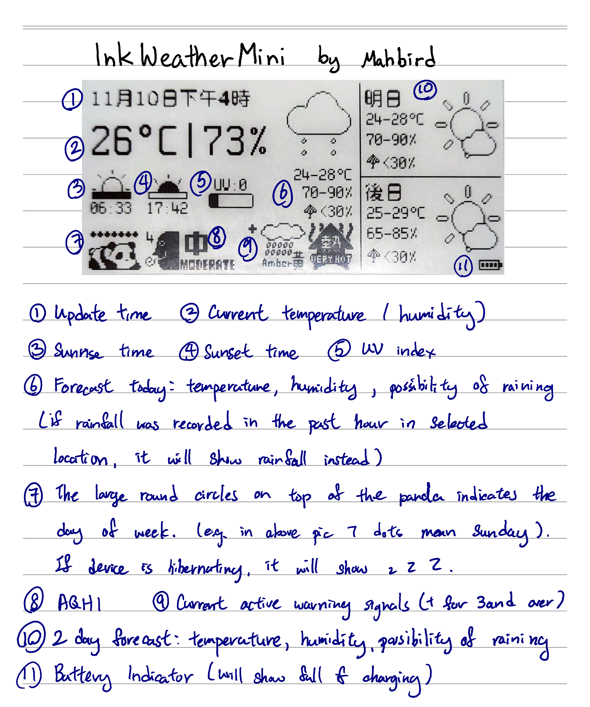
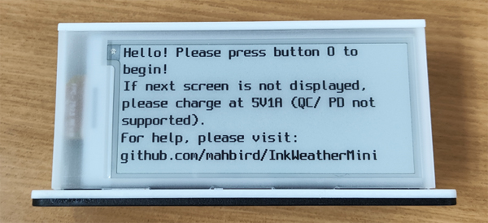
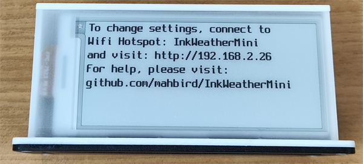
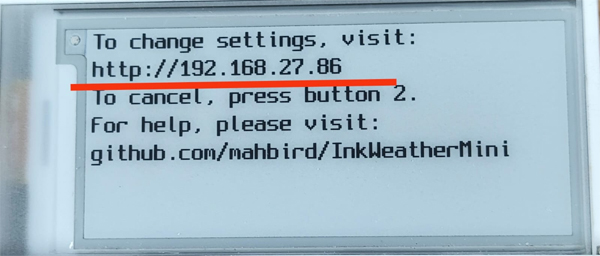

**Information**

**Please charge using 5V 1A, QC/ PD is not supported**

You can use any usb charger that are rated at 5V, that is rated at 1A or higher, or just your computer's USB port.
When charging, LED will be red; when charging is finished, LED will be blue

**The Eink Screen will flicker when refreshing, which is normal** (There are many different models of eink panels, the refreshing behaviour have slight differences)

**Button 1 is reset key. You can press it anytime to fetch weather immediately. DO NOT press when the screen is refreshing**

Initial Set Up:

(Initial Screen)

1. Short Press button 0. The following screen will load (If the screen is not refreshed, please charge)

2. Connect to the WiFi hotspot "InkWeatherMini" with your phone or computer

3. Visit http://192.168.2.26 using your web browser (if page does not load correctly, please use google chrome)

*If you get a notification saying there is no internet connection for this WiFi, please click "Keep using this connection"*

- Enter your WiFi credentials (case sensative), adjust settings to your liking and save. Note that only 2.4GHz WiFi band is supported.

(Setting page (softAP), version 1.0)

4. Once settings have been saved, InkWeatherMini will restart and connect to your WiFi to fetch data.

On stable connection, this should take 15 seconds or less. Screen will refresh as soon as data is fetched.

**Working LED indicator**

- Short blink (every 0.5s): InkWeatherMini is trying to connect to WiFi

- On (no blinking): InkWeatherMini is fetching data from web or screen is refreshing

- Long blink (every 2s): Settings mode

**Chagning settings again**

1. To change settings again, please press button 0 when the working LED indicator is off, the following screen will be displayed

2. Short press 0 if you do not need to change our WiFi credentials, it will show the following:

Long press 0 if you need to change WiFi credentials, follow the instruction on initial set up.

3. Using your phone or computer's web browser, go to the displayed URL shown on the InkWeatherMini. (Ensure that both devices are using the same network). 

(Setting page (WiFi), version 1.0)

4. Once settings have been saved, InkWeatherMini will restart (same as initial set up)

*If you would like to cancel settins any time, just press the button on the webpage or press button 1.*

This project is created by mahbird and posted on github. All datas are fetched directly from the providers*. InkWeatherMini will not collect your data. The weather data of the day and your Wifi data is only stored locally in your device.

*api/rss/ntp servers used in this project:

Weather data: https://www.hko.gov.hk/en/weatherAPI/doc/files/HKO_Open_Data_API_Documentation.pdf (according to documentation version 1.2)

AQI: https://www.aqhi.gov.hk/psi/dd/hk_aqhiforecast_tc.pdf

NTP: time.nist.gov, pool.ntp.org, stdtime.gov.hk, time.google.com
