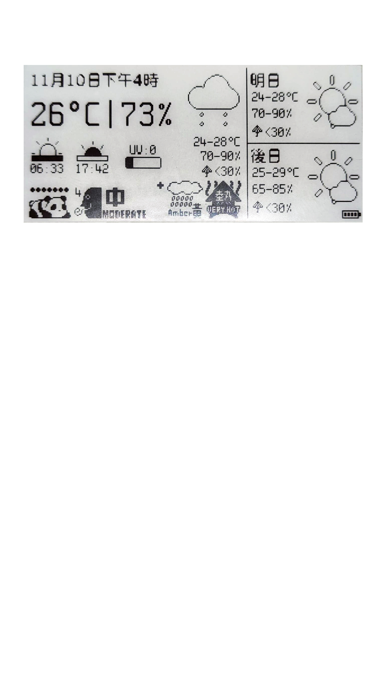
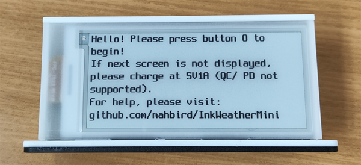
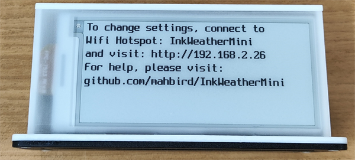
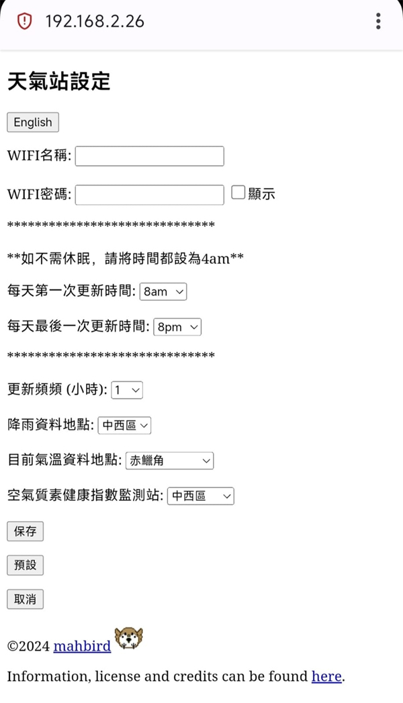
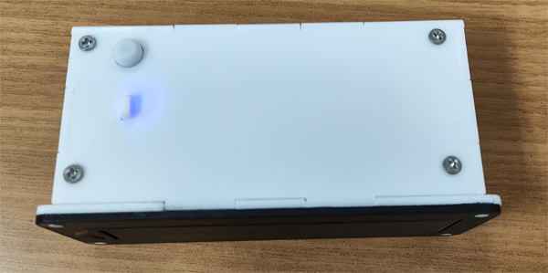
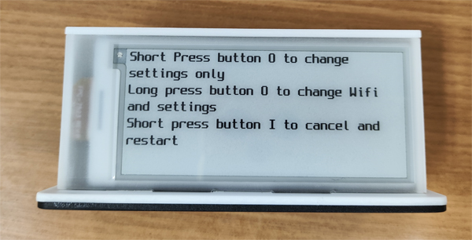
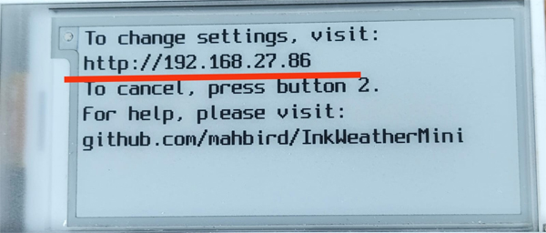
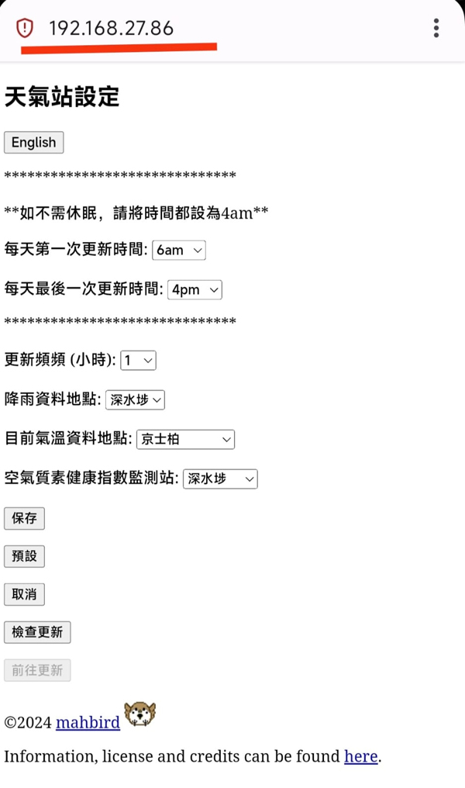

**介面**

**充電為5V 1A，不支援快充，因此充電時間比較長**

請使用5V充電器，電流1A或以上，或USB充電

充電中會亮紅燈，充滿電後亮藍燈

![charging]](Images/charging.jpg)

**EINK屏刷新中會閃爍數次，屬正常現象**

**按鍵1為重啟鍵，短按可以取得即時天氣，如畫面正在刷新請勿按**

https://github.com/user-attachments/assets/db4f93c9-d7ad-4574-b56d-e51dda1d723f

首次設定:

(初始畫面)

1. 短按鍵0，會顯示以下畫面 (如畫面沒有刷新，請將InkWeatherMini充電)

2. 到你的電腦或手機上WIFI連接設定，搜尋網路，點撃"InkWeatherMini"並連接

3. 在電腦或手機上的瀏覽器，前往 http://192.168.2.26 ， 進入設定頁面 (如在這這步驟遇到問題，建議使用google chrome)

- 輸入你的WIFI名稱和密碼 (區分大小寫)，按需求更改其他設定，確定保存後

(設定頁面 (softAP)，版本1.0)

4. 確定保存後，InkWeatherMini會自動重啟並連接到到你輸入的WIFI取得天氣

WiFi穩定時需時約15秒以下，成功取得攻氣後畫面將自動刷新

**工作指示燈:**

- 快閃(0.5s) : InkWeatherMini正在嘗試連接到WIFI

- 長亮: InkWeatherMini正在取得天氣或正在刷新畫面

- 慢閃(2s): 設定模定

**再次更改設定:**

1.如要再次更改設定，在工作指示燈沒有亮起的時間短按鍵0，會顯示以下畫面:

2. 如只需要更改返定，請短按鍵0，InkWeatherMini會連到WIFI，並會顯示以下畫面

如需更改WIFI，長按鍵0，依照首次設定的方式設定

3.在電腦或手機上的瀏覽器 (請確保和InkWeatherMini使用同一個網路)，前往畫面上顯示的網址

(設定頁面 (WiFi)，版本1.0)

4. 確定保存後，InkWeatherMini會自動重啟並更新

*如要取消設定，可在網頁按取取或短按鍵1*

本天氣站為Mahbird設計並發佈於github，實時數據直接向數據提供者*取得，本天氣站不會收集任何數據，當天的預報和你的wifi資料只會保存在你的裝置內

*以下為使用的數據網站:

天氣數據: https://www.hko.gov.hk/en/weatherAPI/doc/files/HKO_Open_Data_API_Documentation.pdf (根據手冊版本1.2)

空氣指數: https://www.aqhi.gov.hk/psi/dd/hk_aqhiforecast_tc.pdf

網路對時: time.nist.gov, pool.ntp.org, stdtime.gov.hk, time.google.com