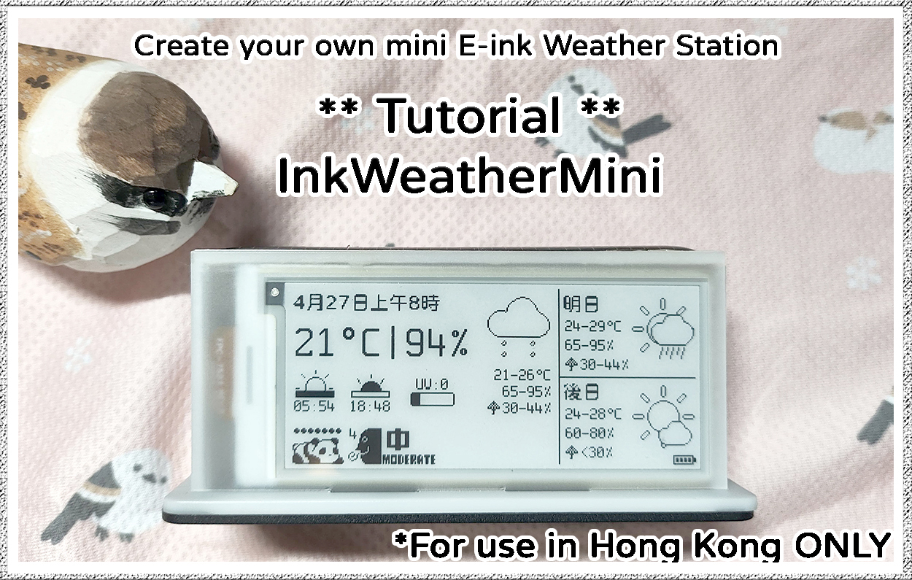
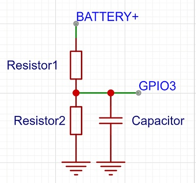

**If you already own an InkWeatherMini, click to go to the [English Manual](Manual_en.md)**

**如你已擁有InkWeatherMini，可以前往[中文使用說明](Manual_zh.md)**

<h1>## Introduction</h1>

This is WeatherMini, a mini e-ink weather station that displays the current weather condition with air quality index and 2 day forcasts. Currently, only 2.9inches eink screens with resolution of 296 x 128px are supported. This should in theory work with colored screens and greyscale but I have only fully tested the b/w screens. Color is also limited so I suggest sticking to b/w.

The project uses Hong Kong Observatory Open Data API for weather data, as well as RSS from Hong Kong Enviromental Protection Department for the AQHI, so can be used in Hong Kong only. No sign up is required.

InkWeatherMini does not collect your data in any form, your configuration data are only stored locally in your device. All interactions are limited to the required API calls directly made to HKO, EPD and NTP server to get the weather information and local time.

**Why e-ink?**  E-ink displays can kept its last displayed content without power supply, so the device is in deep sleep mode between readings intervals. It only wakes up for around ~30-60s on each update (to connect to wifi to fetch NTP and weather data and then 3-20s (depending on the eink panel) for refreshing the screen). It can be viewed under bright light. Depending on the battery and update interval you choose, it will last months without needing to be charged.

*****
**If you are new to e-ink, please take extra care when handling the e-ink screen. They are SUPER FRAGILE, if you drop it or put pressure on it, it is going to be a goner :'(**

Flickering on screen refreshes is, unfortunately, normal for e-ink as far as the current technology goes. 
*****

<h1>##How it works</h1>

https://github.com/user-attachments/assets/ef22c9ca-abf4-482a-b66f-6ace96d78e5b

The WeatherMini first connects to the internet, syncing time with NTP server, then it requests data from HKO API and fetch data from EPD AQHI RSS. 

If any errors happen during any steps above, the relevant error message will be displayed. It will return again in 5 mins. If error still persists after 5 attempts, all subsequent retries will take place every 120 mins. The screen will not update until error is resolved. Error count is saved on the ESP32's NSV using Preferences library, so the count will remain until you have a successful load or if you clear the NVS manually.

After sucessfully getting data, the display will refresh. Once the update is finished, the ESP32 will go into deep sleep until the next wake up interval. Because the internal timer of the ESP32 has about ~5% (according to google), there will be some fluctuations for the update time. 
The display is set to update at around 5 minutes pass each hour by design.

You can always manually press RST on your ESP32 to get data instantly.

<h1>##Building your own InkWeatherMini</h1>

<h2>Materials needed: </h2>
I do not recevie any form of rebate from the manufacturer(s), you are free to try out different ones.

**Verions explained**
Two versions are provided, choose the one base on your need.

**- Source code version (Download the folder InkWeatherMini_RAW): More flexibility *requires basic Arduino knowledge***, you are free to tweak the code to your liking (but please don't redistribute them). You can use other panels that are supported by GxEPD2.
You can also use other ESP32 board.  Configurations are hardcoded in confirgurations.cpp and display_config.h
No external push button needed as you can hardcode your settings easily for simplicity.

**- bin version: For end user.**
The .bin supports only b/w display and includes async web server which allows changing configs via browser and web OTA. 
*You have to use b/w display with the SSD1680 I/C (e.g. GDEY029T94 from Good-display) and any board that uses ESP32-C3-FH4/FN4 chip (e.g. ESP-32-C3 SuperMini) with a push button and connect exactly in this tutorial.*

**E-ink screen:**
- Any 2.9inches eink display with a resolution of 128x296 that are supported by <a href="https://github.com/ZinggJM/GxEPD2">GxEPD2</a> should do.
- *If you are flashing the .bin directly. You have to use b/w display with the SSD1680 I/C (e.g. GDEY029T94 from Good-display)*
- This have been tested on B/W display only.
- Note that while this project is written to also support color display, but they have not been tested.
- You have to use b/w display with the SSD1680 I/C (e.g. GDEY029T94 from Good-display) and ESP32-C3 SuperMini with a push button and connect exactly in this tutorial.

**Microcontroller board:**
- ESP32 / ESP32-C3 /ESP32-S3 / ESP32-C6 should all work fine, 4MB flash. But since this project is less demanding you can just settle with C3 or C6 for lower cost and lower power consumption.
- *If you are flashing the .bin directly. You have to use ESP32-C3 SuperMini (4MB flash) with a push button and connect exactly in this tutorial.*
- ESP32-C3 SuperMini: You can get these for like $2USD each, there are all sort of brands out there since is open sourced. Do get the one with 4mb on board flash. There is also an expansion board that supports LiPo charging.
Supermini: https://www.nologo.tech/en/product/esp32/esp32c3SuperMini/esp32C3SuperMini.html#%E7%AE%80%E4%BB%8B
Expansion board: https://www.nologo.tech/en/product/esp32/esp32c3SuperMini/esp32C3ExpansionBoard.html#%E5%B0%BA%E5%AF%B8%E5%9B%BE
  
The code supports ADC battery voltage reading (if #define batterypin /*pin_number*/), but you would probably want to adjust the voltage/charge% values since batteries are all different.

**E-ink adaptor board:**
- e.g. DESPI-C02
You need an adaptor board to connect the eink screen to your ESP32. There are other brands out there, some options are cheaper and they come in different forms.
You can choose any you like, the DESPI-C02 is just an example.

**Push button x 1 (only for the .bin version):**
Choose any you like. Compulsory if you want to load the .bin file directly, optional if you choose to hardcode configurations directly in the code.

**Resistor x 2, capacitor x 1, Lithium battery, charging circuit: (Optional)**
Just power the device using ESP32C3's USB port if you want to use battery.
Some boards also have on-board charging already.
If not, I personally use 2x 1MOhm resistor with 1nF capacitor (optional), not super accurate but gives an idea of battery charge.
TP4056 is probably the easiest to work with.
Battery icon will be shown in bottom left if valid voltage is read.

**Others:**
You will also need your soldering tools/ materials (wires/ protoboard etc).
I also suggest getting FFC cables and connectors (24pin / 0.5mm) so you have more flexibility with your screen and your board since the FPC cable on the display is fairly short.

<h2>Connecting the wires:</h2>

**Do not feed 5V to the display, most of them operates at 3V3**
*Follow this exact wiring if you are loading the .bin version*
Otherwise, you can change your pin configurations in display_config.h
- DESPI-C02 ->	ESP32-C3 SuperMini: (Or follow the silkscreen on your adaptor board)

- BUSY	->	5

- RES	-> 0

- D/C	->	10

- CS	->	7

- SCK	->	4

- SDI/MOSI	->	6

- GND	->	GND 

- 3V3	->	3V3

**Push button (bin version only)**
One leg to GPIO 3, the other to 3V3

**Battery voltage divider (optional)**

(capacitor is optional)

Then connect the screen to the connector on the board. Pay attention to the orientation of the screen, usually both the display and the adaptor board should be facing up , but this might be the opposite for some adaptor boards. If screen doesn't work, try the other way round.

<h2>Flashing firmware for .bin Version</h2>

Just download InkWeatherMini_full.bin
and go to https://espressif.github.io/esptool-js/
Connect your mcu, the flash the .bin at 0x0
If everything is connected correctly

*******

<h2>Software Installation: </h2>
Software: **For RAW version**
- Install Arduino IDE:
https://www.arduino.cc/en/software

- Install libraries (see the top section in the .ino file)
**Important Note:**
!!
U8g2_for_Adafruit_GFX is used in this project, but the font list is not as updated as the main u8g2, and the spleen font family used is one of them.

You need to download the both the u8g2 and U8g2_for_Adafruit_GFX library, then replace the font list in between /* start font list */
 /* C++ compatible */ in U8g2_for_Adafruit_GFX/src/U8g2_for_Adafruit_GFX.h with the ones in u8g2/csrc/u8g2.h

Then replace everything but the #include "u8g2_fonts.h" in U8g2_for_Adafruit_GFX/src/u8g2_fonts.c  with u8g2/csrc/u8g2_fonts.c

Once you are done replacing the files, you can uninstall the main u8g2 library

If you find this too complicated, you may consider trying different fonts
!!

<h2>Configurable settings:</h2>

**configurations.cpp**

Settings with info are found in the file "configurations.cpp"

- ssid - your wifi SSID

- password - your wifi password

- wakehour - The hour which the first update of the day starts, in 24 hour time. *Please keep it below 10, otherwise today min max temperature cannot show correctly.

*The min and max temperature of the current day is actually taken from the forecast and not from current weather, and the forecast of the current day disapper sometime after 10-11am, so if the weather postcard has not gotten any data from the HKO since the day changed, it will not have any actual data for the min max for the day (instead, the min max shown will be the min max for the next day.) I have checked HKO's API numberous time, but if you find the min max temperature for the current day elsewhere, let me know and I can adjust the code.

- sleephour - The hour of the last update**, in 24 hour time (e.g. 10pm = 22).

- updateinterval - The frequency which the display is updated, in hours**.

**Update interval precedes sleep hour, so say you have set 3 hour update interval with 8am(8) wakehour and 10pm(22) sleephour, the last update will take place at 11pm.

- tmpClocation: Location for the current temperature data. Please refer to "locations.h" for the list of avaiable locations.

- rainlocation: Location for the rainfall of last hour data. Please refer to "locations.h" for the list of avaiable locations. 

- AQIstation: Location for the Air quality station. Please refer to "locations.h" for the list of avaiable locations. 

- LED_on: true for LED indicator. If set to true, change LED_pin to your on board LED

**Display Configurations:**

Configuration for the display is in "displayconfig.h"

Choose the correct display and display class for your eink panel, and define the pins you use.

- batterypin: assign the ADC pin to read battery voltage, simply comment// this line if not needed. You may also want to change the voltage to % level depending on the voltage divider and the type of battery you are using.

********

If you notice anything wrong with the code or have any suggestions, just let me know, thank you.

********

All icons are drawn by mahbird. (a.k.a. the project creator)

<h1>##Credits: </h1>

These are the libaries and resources used in this project:

ArduinoJson by bblanchon: https://github.com/bblanchon/ArduinoJson

GxEPD2 by ZinggJM: https://github.com/ZinggJM/GxEPD2

u8g2 fonts by olikraus: https://github.com/olikraus/u8g2

Adafruit_GFX by Adafruit: https://github.com/adafruit/Adafruit-GFX-Library

ESPAsyncWebServer/ AsyncTCP by me-no-dev: https://github.com/me-no-dev/ESPAsyncWebServer / https://github.com/me-no-dev/AsyncTCP

Fonts used:
Spleen by fcambus: https://github.com/fcambus/spleen
open-huninn-font: https://github.com/justfont/open-huninn-font

Font converter: https://rop.nl/truetype2gfx/

Data service provider:

Weather data: https://www.hko.gov.hk/en/weatherAPI/doc/files/HKO_Open_Data_API_Documentation.pdf (according to documentation version 1.2)

AQI: https://www.aqhi.gov.hk/psi/dd/hk_aqhiforecast_tc.pdf

NTP: time.nist.gov, pool.ntp.org, stdtime.gov.hk, time.google.com

##[License](License)

