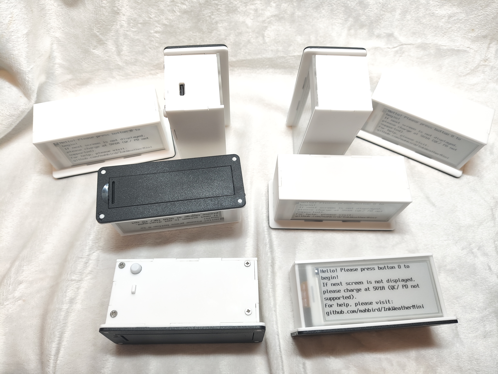

這是一批我少量製作的InkWeatherMini，白色磨砂亞克力版，透明亞克力蓋版，18650電池座，配一節18650鋰電池

使用type-c 5V1A充電，如果有需要可以自行取出18650電池更換

整機大小(mm)，約: 95(W) x43(H) x40(D) 
顯示區域 (mm): 29.056 x 66.896

https://github.com/user-attachments/assets/ef22c9ca-abf4-482a-b66f-6ace96d78e5b
刷新畫面

由於手工組裝，難免有瑕疵，不適合完美主意者

售價$120，有意購買可以[FACEBOOK聯絡](https://m.me/mahbird)

如果軟件出BUG，請跟我說我會盡快修，如果你沒有摔過也沒有厭到它而它在1年內壞了，你可以拿回給我看看能不能修好/給你退款

有提議也可以跟我說，我可以看看能不能加進去

(如果你覺得價錢太貴，真的非常抱歉，因為少量製作的不算時間光是算材料成本已經很高)

**硬件只支援2.4GHz的WIFI，如果你的WIFI是5GHz，會需要你修改router/hotspot的設定**

[English Manual](Manual_en.md)

[中文使用說明](Manual_zh.md)
